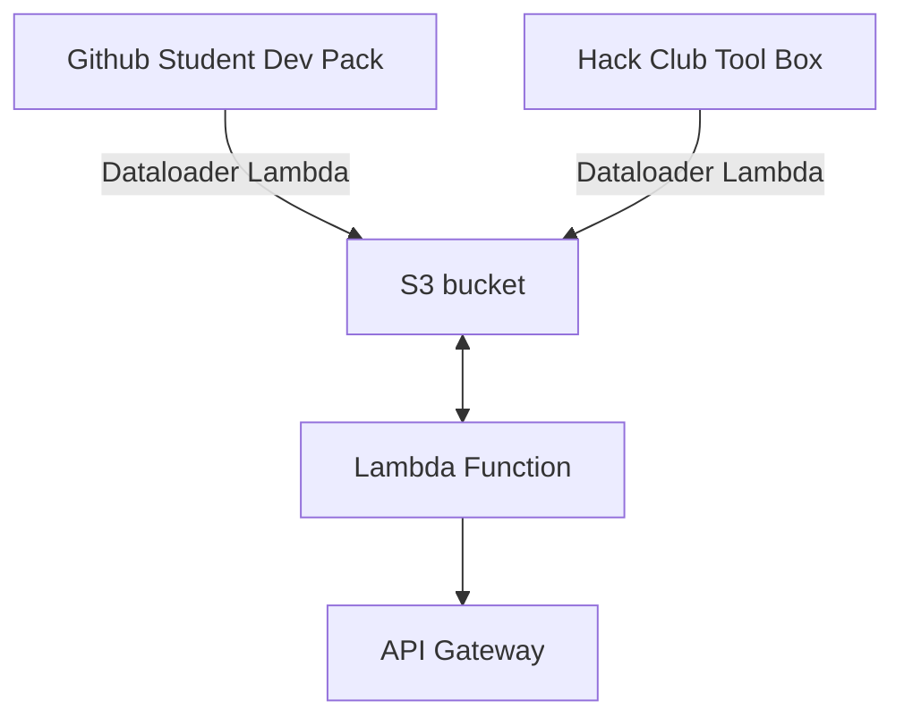

# FreeStuff
Supposed to be a website to find free stuff teenagers/student can use to build projects and explore tech.

# Backend Architecture on AWS

**The Tech Stack used to build the backed was:**
- AWS CDK using Typescript
- Python3 to write the lambda code
- AWS S3 for storage

**The Tech Stack used to build the backed was:**
- React with Next.js
- Tailwind CSS
- TypeScript
- shadcn for components

What I learned?
I learned the basics of next.js and got a grasp on reacts structure.

